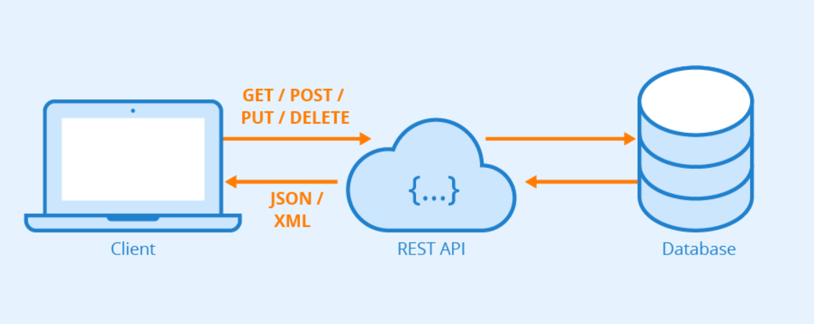

# Labecommerce - Backend

Este é o backend para o LabEcommerce, uma aplicação de comércio eletrônico.

## Descrição

O LabEcommerce (**_Back End_**) é uma plataforma de comércio eletrônico onde os usuários podem gerenciar produtos e realizar compras. Este backend fornece endpoints para realizar operações CRUD (Create, Read, Update, Delete) em usuários e produtos.

## Documentação desta API:
- **Postman**
- **_https://documenter.getpostman.com/view/29849540/2s9YkjAibP_**

## Configuração

Este projeto utiliza o Node.js ter ele instalado na sua maquina se faz necessario
 - ⚒️ - [Node.js](https://nodejs.org) ◀️ Instale clicando neste link

Para executar este projeto **localmente**, siga as etapas:

1. ⏩ Clone este repositório.
```
https://github.com/DavidBrito32/labecommerce-backend.git
```
2. ⏩ Instale as dependências necessárias usando :
```
npm install
```
Ou 

```
yarn install
```

3. ⏩ Configure as variáveis de ambiente, se necessário.

4. ⏩ Execute o servidor usando:
```
npm run start
```
Ou 

```
yarn start
```
5. ⏩ Após isso entre no **_Postman_** ou **_Insomnia_** acessando a BASE URL: 
```
http://localhost:3003/
```

## Tecnologias Utilizadas

- ⚒️ [Node.JS](https://nodejs.org)
-  ⚡ [Typescript](https://typescriptlang.org)
- 💱 [SQLite](https://www.sqlite.org/index.html)
- 🎲 [Knex](https://knexjs.org/) 
- 🛅[Express.js](https://expressjs.com/pt-br/)

## Contribuição

🤝 Contribuições são bem-vindas! Sinta-se à vontade para abrir uma issue ou enviar um pull request.

## Autor
* 👨‍💻 [David Brito](davidbrito.carneiro458@gmail.com)